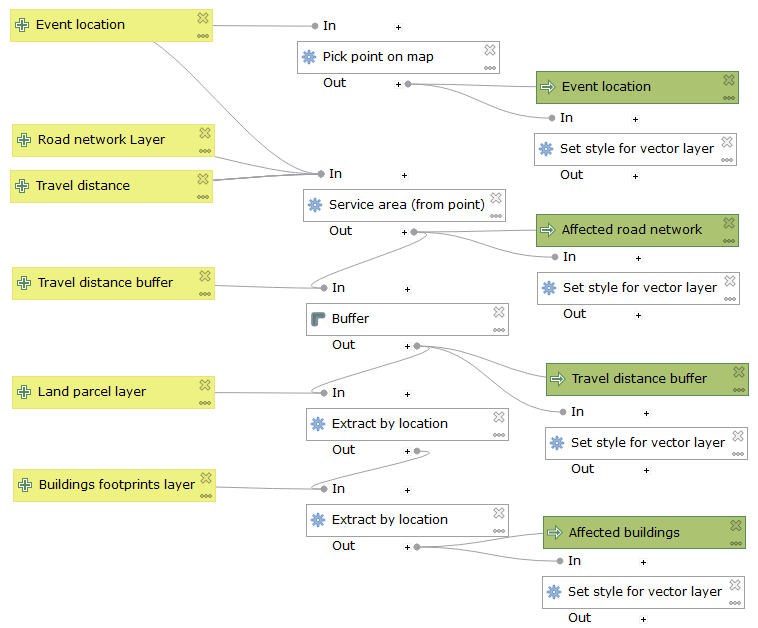
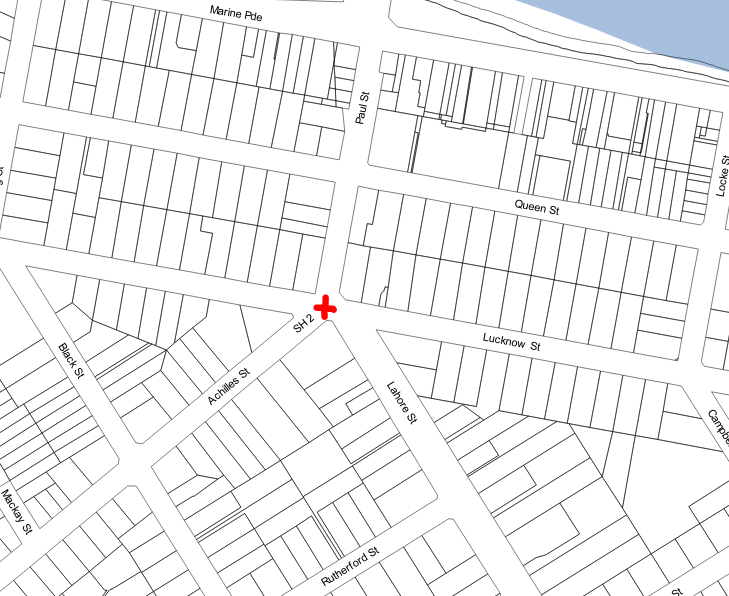
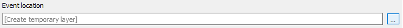
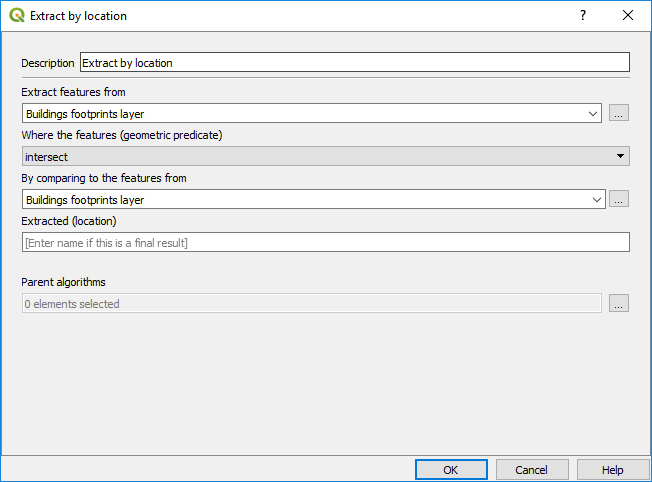

Processing Models
=================

The objectives of this module are to learn about:

-   Processing Models

-   The Graphical Modeller

Processing Models and the Graphical Modeler
-------------------------------------------

The graphical modeler, is a powerful component that we can use to define a
workflow and run a chain of algorithms (a processing model).

A normal session with the processing framework tools includes more than running
a single algorithm. Usually several of them are run to obtain a result, and the
outputs of some of those algorithms are used as input for some of the other
ones.

Using the graphical modeler, that workflow can be put into a processing model,
which will run all the necessary algorithms in a single run, thus simplifying
the whole process and automating it.

Exercise – Affected Buildings Model
-----------------------------------

In this exercise we will create a processing model in the graphical modeler that
displays buildings affected by some event within a distance from the event
location.

The affected buildings are determined by

-   travelling a distance along the road network from the event location,

-   buffering the travel distance to intersect land parcels,

-   extracting building footprints that that intersect the land parcels.

The Inputs

-   Event location point chosen on the Map Canvas

-   Road network layer

-   Travel distance value

-   Travel distance buffer value

-   Land parcel layer

-   Building footprints layer

The outputs

-   Event location point layer

-   Affected road network line layer

-   Travel distance buffer polygon layer

-   Affected buildings polygon layer

### Creating the model

-   In the **Processing toolbox**, click the

    

    **Models** tool, choose **Create New Model…**  
      
    

    

      
      
    Note that the graphical **Processing modeler** window opens  
      
    

    

-   In the **Model properties** panel, set the **Name** to **Affected
    Buildings**

-   In the **Model properties** panel, set the **Group** to **Training**  
      
    

    

-   Save the model by clicking the save tool on the toolbar  
      
    The **Save Model** dialog will be displayed.

-   Set the **File name** to **affectedbuildings**  
      
    

    

The save path for your model will be like…

**C:\\Users\\training\\AppData\\Roaming\\QGIS\\QGIS3\\profiles\\default\\processing\\models**  

-   Click the **Save** button

### Adding the first input parameter

Our first input is the Event location point that will be chosen on the Map
Canvas

-   In the **Inputs** panel, double click the **Point** input  
      
    Note that a **Parameter Definition** dialog opens

-   Set **Parameter name** to **Event Location**  
      
    

    

-   Click the **OK** button  
      
    Note that we now have the first input parameter in our graphical modeler…  
      
    

    

      
    The input parameter can be dragged in the window and to edit double click.

### Adding the first algorithm and output

Our next task is to assign this **input** parameter to an **algorithm**

-   Switch to the **Algorithms** panel (use the tabs at the bottom of the Inputs
    panel)  
      
    Note that the panel now displays the different categories of algorithms
    available to the graphical modeler…  
      
    

    

-   **Expand** the **Scripts** category, then expand **Custom Scripts**

-   **Double click** the **Pick point on map** script  
      
    Note that a dialog opens for the **Pick point on map** script…  
      
    

    

-   Set **Pick a point on the map (x, y)** dropdown list to **Event Location**
    (that’s the input parameter we defined previously)  
      
    

    

-   Set **Output layer** to **Event location** (this will be the name of the
    output layer displaying the event location point in QGIS)  
      
    

    

-   Click the **OK** button  
      
    Note that the **Pick point on map** script has been added to the graphical
    modeler, along with the output layer…  
      
    

    

-   Re-position the items to look like below…  
      
    

    

-   Save the model by clicking the save tool on the toolbar

### Testing the model

We now have an input parameter, an algorithm and an output – let’s test the
model.

-   Close the **Processing Modeler** window

-   In the **Processing toolbox**, expand the **Models** category, then expand
    the **Training** group  
      
    

    

-   **Double click** the model named **Affected Buildings**  
      
    Note that Affected Buildings dialog is displayed…  
      
    

    

-   Click the option button next to the **Event location (x, y)** textbox  
      
    Note that we are switched to the **Map Canvas** and we can click a location
    for the event on the Map Canvas.  
      
    **Click a location** as indicated below on the **Map Canvas**…  
      
    

    

-   The **Event location (x, y)** textbox will now be populated with the
    coordinates of the location we clicked on the Map Canvas  
      
    

    

-   Leave the **Event location** output set to **[Create temporary layer]**  
      
    

    

-   Click the **Run** button

-   When the **Coordinate Reference System Selector** dialog opens, click the
    **OK** button  
      
    

    

-   In the **Affected Buildings** dialog, click the **Close** button

The **Map Canvas** should now show a point feature for the location we chose,
and the **Layers Panel** will display a new temporary layer named **Event
location**…  
  

### Edit the existing model

-   In the **Processing toolbox**, expand the **Models** category, then expand
    the **Training** group  
      
    

    

-   **Right click** the model named **Affected Buildings**, choose **Edit
    Model…** to open the **Graphical Modeler** window  
      
    

    

### Add input parameter for Road network layer 

Let’s add the input parameter for the road network layer

-   Switch to the **Inputs** panel (use the tabs at the bottom of the Algorithms
    panel)

-   **Double click** the **Vector Layer** input  
      
    Note that a **Parameter Definition** dialog opens

-   Set **Parameter name** to **Road network layer**

-   Set **Geometry Type** to **Line**  
      
    

    

-   Click the **OK** button

-   Re-position the items to look like below…  
      
    

    

-   Save the model by clicking the save tool on the toolbar

### Add input parameter for Travel distance 

Now let’s add the travel distance input parameter

-   **Double click** the **Number** input

-   Set **Parameter name** to **Road network layer**

-   Set **Min value** to **1**

-   Set **Max value** to **10000**

-   Set **Default value** to **200**  
      
    

    

-   Click the **OK** button

-   Re-position the items to look like below…  
      
    

    

-   Save the model by clicking the save tool on the toolbar

### Add algorithm for Service area (from point)

Now well add an algorithm that calculates the service area form the event
location along our road network

-   Switch to the **Algorithms** panel (use the tabs at the bottom of the Inputs
    panel)

-   In the **Algorithms** panel, type **service** in the **search** bar  
      
    Note that the list of algorithms is automatically filtered as we type in the
    search value…  
      
    

    

-   **Double click** the **Service area (from point)** algorithm  
      
    Note that the **Service area (from point)** properties dialog opens…  
      
    

    

-   Set **Vector layer representing network** to **Road network layer**

-   Set **Start point (x, y)** to **Event location**

-   Click the option button next to the **Travel cost** textbox  
      
    Note the **Expression Based Input** dialog window opens…  
      
    

    

-   Remove the value **0.0** in the expression panel

-   Double click the **traveldistance** variable in the middle panel  
      
    

    

-   Click the **OK** button

>   Note that the **Travel cost** is now populated with the variable
>   **\@traveldistance**  
>     
>   

-   Set the **Service area (lines)** to **Affected road network**  
      
    

    

The **Service area (from point)** properties dialog should look like…

-   Click the **OK** button

-   Re-position the items to look like below…  
      
    

    

-   Save the model by clicking the save tool on the toolbar

### **Add input parameter for road network buffer**

Now let’s add the input parameter for the road network buffer

-   Switch to the **Inputs** panel (use the tabs at the bottom of the Algorithms
    panel)

-   **Double click** the **Number** input

-   Set **Parameter name** to **Travel distance buffer**

-   Set **Min value** to **1**

-   Set **Max value** to **1000**

-   Set **Default value** to **20**  
      
    

    

-   Click the **OK** button

-   Re-position the items to look like below…  
      
    

    

-   Save the model by clicking the save tool on the toolbar

### Add algorithm for buffer

Now let’s add the buffer algorithm

-   Switch to the **Algorithms** panel (use the tabs at the bottom of the Inputs
    panel)

-   In the **Algorithms** panel, type **buffer** in the **search** bar  
      
    

    

-   **Double click** the QGIS **Buffer** algorithm  
      
    Note that the **Buffer** properties dialog opens…  
      
    

    

-   Set **Input layer** to **'Service area (lines)' from algorithm 'Service area
    (from point)'**  
      
    

    

-   Click the option button next to the **Distance** textbox  
      
    Note the **Expression Based Input** dialog window opens…  
      
    

    

-   Remove the value **10** in the expression panel

-   Double click the **traveldistancebuffer** variable in the middle panel  
      
    

    

-   Click the **OK** button

-   Note that the **Distance** is now populated with the variable
    **\@traveldistancebuffer**  
      
    

    

-   Set **Buffered** to **Travel distance buffer**  
      
    

    

The **Buffer** properties dialog should look like…

-   Click the **OK** button

-   Re-position the items to look like below…  
      
    

    

-   Save the model by clicking the save tool on the toolbar

### **Add input parameter for land parcel layer**

Now let’s add the input parameter for the land parcel layer

-   Switch to the **Inputs** panel (use the tabs at the bottom of the Algorithms
    panel)

-   **Double click** the **Vector Layer** input  
      
    Note that a **Parameter Definition** dialog opens

-   Set **Parameter name** to **Land parcel layer**

-   Set **Geometry Type** to **Polygon**  
      
    

    

-   Click the **OK** button

-   Re-position the items to look like below…  
      
    

    

-   Save the model by clicking the save tool on the toolbar

### Add algorithm for extracting by location for land parcels

Now let’s add the extract by location algorithm

-   Switch to the **Algorithms** panel (use the tabs at the bottom of the Inputs
    panel)

-   In the **Algorithms** panel, type **extract by** in the **search** bar  
      
    

    

-   **Double click** the **Extract by location** algorithm  
      
    Note that the **Extract by location** properties dialog opens…  
      
    

    

-   Set **By comparing to the features from** to **'Buffered' from algorithm
    'Buffer'**  
      
    

    

The **Extract by location** properties dialog should look like…

-   Click the **OK** button

-   Re-position the items to look like below…  
      
    

    

-   Save the model by clicking the save tool on the toolbar

### **Add input parameter for building footprints layer**

Now let’s add the input parameter for the building footprints layer

-   Switch to the **Inputs** panel (use the tabs at the bottom of the Algorithms
    panel)

-   **Double click** the **Vector Layer** input  
      
    Note that a **Parameter Definition** dialog opens

-   Set **Parameter name** to **Buildings footprints layer**

-   Set **Geometry Type** to **Polygon**  
      
    

    

-   Click the **OK** button

-   Re-position the items to look like below…  
      
    

    

-   Save the model by clicking the save tool on the toolbar

### Add algorithm for extracting by location for building footprints

Now let’s add the extract by location algorithm

-   Switch to the **Algorithms** panel (use the tabs at the bottom of the Inputs
    panel)

-   In the **Algorithms** panel, type **extract by** in the **search** bar  
      
    

    

-   **Double click** the **Extract by location** algorithm  
      
    Note that the **Extract by location** properties dialog opens…  
      
    

    

-   Set **By comparing to the features from** to **'Extracted (location)' from
    algorithm 'Extract by location'**  
      
    

    

-   Set **Extracted (location)** to **Affected buildings**  
      
    

    

The **Extract by location** properties dialog should look like…

-   Click the **OK** button

-   Re-position the items to look like below…  
      
    

    

-   Save the model by clicking the save tool on the toolbar

### Running the model

We now have our processing model completed – let’s run the model.

-   Close the **Processing Modeler** window

-   In the **Layers panel** remove the layer named **Event Location** from our
    previous testing.

-   In the **Processing toolbox**, expand the **Models** category, then expand
    the **Training** group  
      
    

    

-   **Double click** the model named **Affected Buildings**  
      
    Note that Affected Buildings dialog is displayed…  
      
    

    

-   Click the

    

    option button next to the **Event location (x, y)** textbox  
      
    Note that we are switched to the **Map Canvas** and we can click a location
    for the event on the Map Canvas.  
      
    **Click a location** as indicated below on the **Map Canvas**…  
      
    

    

The **Event location (x, y)** textbox will now be populated with the coordinates
of the location we clicked on the Map Canvas

-   Set **Buildings footprints layer** to
    **Wairoa_Vector_Buildings_SwimmingPools**  
      
    

    

-   Set **Land parcel layer** to **nz_primary_land_parcels**  
      
    

    

-   Set **Road network layer** to **nz_roads_addressing**  
      
    

    

-   Click the **Run** button

-   When the **Coordinate Reference System Selector** dialog opens, click the
    **OK** button  
      
    

    

-   In the **Affected Buildings** dialog, click the **Close** button

The **Map Canvas** should now show the results of the **Affect buildings**
processing model…

### Setting styles for the output layers

Whenever the **Affected Buildings** model is run the output layers styles are
determined randomly by QGIS.

We can extend our model by applying a QGIS **.qml** style file to each layer
output

We have the following pre-defined style files:

-   C:\\Training\\AffectedBuildings_event_location.qml

-   C:\\Training\\AffectedBuildings_travel_distance_buffer.qml

-   C:\\Training\\AffectedBuildings_affected_road_network.qml

-   C:\\Training\\AffectedBuildings_affected_buildings.qml

These style files define the following styles:

Let’s start editing our model

-   In the **Processing toolbox**, expand the **Models** category, then expand
    the **Training** group  
      
    

    

-   **Right click** the model named **Affected Buildings**, choose **Edit
    Model…** to open the **Graphical Modeler** window  
      
    

    

Add the Event Location style

-   In the **Algorithms** panel, type **style** in the **search** bar  
      
    

    

-   **Double click** the **Set style for vector layer** algorithm  
      
    Note that the **Set style for vector layer** properties dialog opens…

-   Set **Vector layer** to **'Output layer' from algorithm 'Pick point on
    map'**

-   Set **Style file** to **C:\\Training\\AffectedBuildings_event_location.qml**  
      
    

    

-   Click the **OK** button

-   Re-position the items

Add the Affected road network style

-   **Double click** the **Set style for vector layer** algorithm

-   Set **Vector layer** to **'Service area (lines)' from algorithm 'Service
    area (from point)'**

-   Set **Style file** to
    **C:/Training/AffectedBuildings_affected_road_network.qml**  
      
    

    

-   Click the **OK** button

-   Re-position the items

Add the Travel distance buffer style

-   **Double click** the **Set style for vector layer** algorithm

-   Set **Vector layer** to **'Buffered' from algorithm 'Buffer'**

-   Set **Style file** to
    **C:/Training/AffectedBuildings_travel_distance_buffer.qml**  
      
    

    

-   Click the **OK** button

-   Re-position the items

Add the Affect buildings style

-   **Double click** the **Set style for vector layer** algorithm

-   Set **Vector layer** to **'Extracted (location)' from algorithm 'Extract by
    location'**

-   Set **Style file** to
    **C:/Training/AffectedBuildings_affected_buildings.qml**  
      
    

    

-   Click the **OK** button

-   Re-position the items

Our model should look like this now…

-   Save the model by clicking the save tool on the toolbar

### Running the final model with styling

We now have our processing model completed – let’s run the model.

-   Close the **Processing Modeler** window

-   In the **Layers panel** remove the layers from previous running of the model

    -   **Event Location**

    -   **Affected road network**

    -   **Travel distance buffer**

    -   **Affected buildings**

-   In the **Processing toolbox**, expand the **Models** category, then expand
    the **Training** group  
      
    

    

-   **Double click** the model named **Affected Buildings**  
      
    Note that Affected Buildings dialog is displayed…  
      
    

    

-   Click the

    

    option button next to the **Event location (x, y)** textbox  
      
    Note that we are switched to the **Map Canvas** and we can click a location
    for the event on the Map Canvas.  
      
    **Click a location** as indicated below on the **Map Canvas**…  
      
    

    

The **Event location (x, y)** textbox will now be populated with the coordinates
of the location we clicked on the Map Canvas

-   Set **Buildings footprints layer** to
    **Wairoa_Vector_Buildings_SwimmingPools**  
      
    

    

-   Set **Land parcel layer** to **nz_primary_land_parcels**  
      
    

    

-   Set **Road network layer** to **nz_roads_addressing**  
      
    

    

-   Click the **Run** button

-   When the **Coordinate Reference System Selector** dialog opens, click the
    **OK** button  
      
    

    

-   In the **Affected Buildings** dialog, click the **Close** button

The **Map Canvas** should now show the results of the **Affect buildings**
processing model with our style files applied to each output layer…

### Editing model help

We can document our models from within the graphical modeler itself.

To document our **Affected Buildings** model, let’s start by editing our model

-   In the **Processing toolbox**, expand the **Models** category, then expand
    the **Training** group  
      
    

    

-   **Right click** the model named **Affected Buildings**, choose **Edit
    Model…** to open the **Graphical Modeler** window  
      
    

    

Now let’s edit the model help

-   In the **Graphical Modeler** window, click the

    

    **Edit model help** tool on the toolbar  
      
    Note that **Help Editor** dialog opens…  
      
    

    

-   Select the element named **Algorithm description** in the **Select element
    to edit panel**  
      
    

    

-   Click inside the **Element Description** panel, and **type a description**
    for the model  
      
    TIP – Copy and paste the text saved in the file
    C:\\Training\\AffectedBuildings_help_text.txt  
      
    

    

-   Click the **OK** button

-   In the **Graphical Modeler** window, click the

    

    **Run model** tool on the toolbar

>   Note that the Model now displays a description panel on the right-hand side
>   of the model dialog…

-   Click the **Close** button

-   Save the model by clicking the save tool on the toolbar
